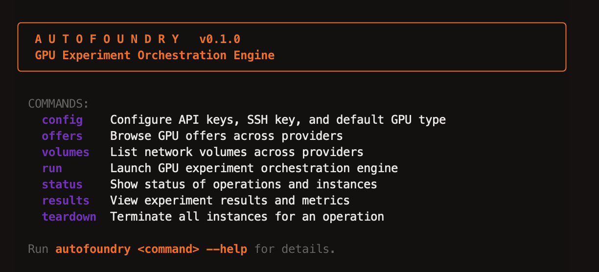

# Autofoundry

Run any ML experiment script across GPUs on multiple cloud providers with a single command.

<p align="center">
  
</p>

Autofoundry is a CLI companion to [Karpathy's autoresearch](https://github.com/karpathy/autoresearch). Point it at a shell script, pick your GPU configuration, and it handles the rest: provisioning instances, distributing experiment runs, streaming results live, and producing a final metrics report.

## Supported Providers

- **[RunPod](https://www.runpod.io/)** — Secure and Community cloud
- **[Vast.ai](https://vast.ai/)** — Global GPU marketplace
- **[PRIME Intellect](https://www.primeintellect.ai/)** — Decentralized GPU network
- **[Lambda Labs](https://lambdalabs.com/)** — On-demand cloud GPUs

## Quickstart

```bash
git clone https://github.com/autofoundry/autofoundry.git
cd autofoundry
uv pip install -e .
autofoundry run scripts/run_autoresearch.sh -g H100 --provider runpod --auto
```

On first run, Autofoundry walks you through configuring provider API keys and your SSH key path. Config is saved to `~/.config/autofoundry/config.toml`.

If you already have your own experiment scripts, you can install just the CLI:

```bash
pip install autofoundry
```

## How It Works

```
autofoundry run train.sh --num 4 --gpu H100
```

1. **Query providers** — Fetches real-time GPU pricing and availability across all configured providers
2. **Select GPUs** — Interactive table lets you pick offers and quantities
3. **Provision** — Spins up instances in parallel, waits for SSH ready
4. **Execute** — Uploads your script, distributes experiments round-robin across instances, streams output live
5. **Report** — Parses metrics from script output and displays best/mean/worst summary
6. **Teardown** — Terminates all instances on completion (or Ctrl-C)

## Experiment Scripts

Your script runs in `/workspace` on a GPU instance with CUDA available. To report metrics back to Autofoundry, print a `---` delimiter followed by `key: value` lines:

```bash
#!/usr/bin/env bash
set -e

# ... your training code ...

echo "---"
echo "val_loss: 0.42"
echo "accuracy: 91.3"
echo "training_seconds: 300"
```

Autofoundry aggregates these across all experiment runs in the final report.

## Example: autoresearch

Run [Karpathy's autoresearch](https://github.com/karpathy/autoresearch) on any provider:

```bash
autofoundry run scripts/run_autoresearch.sh -g H100 --provider runpod --region US --auto
autofoundry run scripts/run_autoresearch.sh -g H100 --provider lambdalabs --region US --auto
autofoundry run scripts/run_autoresearch.sh -g H100 --provider vastai --auto
autofoundry run scripts/run_autoresearch.sh -g H100 --provider primeintellect --auto
```

This provisions an H100, clones autoresearch, trains a 50M parameter language model, and reports metrics including validation BPB, MFU, and throughput.

## Network Volumes

Attach persistent storage so dependencies survive across runs:

```bash
# First run — creates volume, installs deps to /workspace
autofoundry run scripts/run_autoresearch.sh --volume my-workspace --provider runpod

# Second run — finds existing volume, skips install
autofoundry run scripts/run_autoresearch.sh --volume my-workspace --provider runpod
```

Supported on RunPod and Lambda Labs.

## Resuming Sessions

If a session is interrupted, resume it to restart stopped instances and run remaining experiments:

```bash
autofoundry run scripts/run_autoresearch.sh --resume <session-id>
```

## CLI Reference

```
autofoundry run <script> [OPTIONS]

Arguments:
  script              Path to experiment shell script

Options:
  --num, -n           Number of experiment runs (default: 1)
  --gpu, -g           GPU type to search for (default: H100)
  --resume, -r        Resume a previous session
  --volume, -v        Network volume name (RunPod, Lambda Labs)

autofoundry config          Configure provider API keys
autofoundry inventory       Browse GPU inventory
autofoundry volumes         List network volumes
autofoundry status [OP_ID]  Show operation status
autofoundry results OP_ID   Show experiment metrics
autofoundry teardown OP_ID  Terminate instances
```

## Architecture

```
cli.py           Entry point — run, config, reserves, volumes, status, results, teardown
planner.py       GPU offer querying and selection
provisioner.py   Instance lifecycle management
executor.py      SSH-based script upload and execution
reporter.py      Metrics aggregation and display
providers/       Provider API implementations
models.py        Data models (GpuOffer, InstanceConfig, VolumeInfo, Session)
config.py        TOML configuration management
state.py         SQLite session persistence
theme.py         Terminal styling
```

## Requirements

- Python 3.11+
- SSH key pair (ed25519 or RSA)
- At least one provider API key (RunPod, Vast.ai, PRIME Intellect, or Lambda Labs)

## License

[MIT](LICENSE)
